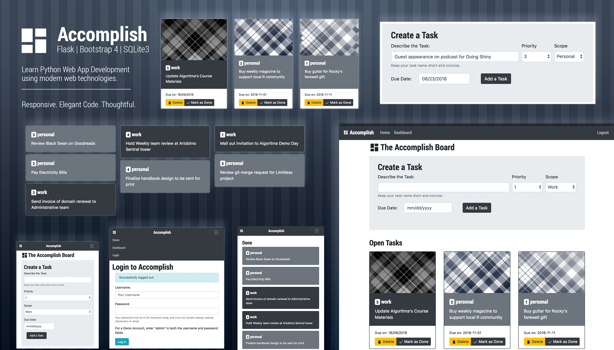

# Accomplish
## What is it?
A multi-series tutorial walking through the development of a task manager app, CRUD operations, and a cohesive UI design using the latest from Bootstrap and Material Design.

Key features in the lesson:
- [Flask](http://flask.pocoo.org/), a Python Microframework
- [Bootstrap](https://getbootstrap.com/), a set of HTML and CSS tools
- [SQLite](https://www.sqlite.org/index.html), a self-contained, embedded SQL database engine
- [Material Design](https://material.io/), additional UI tools
- [Conda](https://conda.io/) for virtual environment and package management

### Functionalities
- Setting up your Flask project
    - Managing Environments
    - Managing Dependencies
    - Planning the DB ahead of time
    - Setting up Git and GitHub 
- Template Rendering
    - Understanding `url_for`
    - Understanding `render_template`
    - Understanding `extends` and `block`
    - Jinja2
- Assets Management
- Database
    - SQLite Introduction
    - CRUD (Create, Read, Update, Delete)
    - Executing SQL commands from Flask
- Log In / Log Out session(s)
    - Understanding `session`
    - Understanding `before_request()`
- UI and UX Design
    - Using Bootstrap 4
    - Using Material Design
    - Using `flash` for notifications
    - Dynamic background image rendering using `send_file`
- Miscellaneous
    - Decorators and `wraps`
    - Understanding `redirect`
    - Understanding `g`
    - Importing configuration and thinking about security

## Why?
There are no shortage of good tutorials that on their own, does a tremendous job at introducing new programming languages and tools to the absolute beginner. However, my motivation at creating a multi-series tutorial with this project is two-fold:

1. Many tutorials online serves as introductory materials to Flask, and as such often falls short in the required depth to help the reader go beyond 'hello world' to a more intermediary phase of Flask app development. 
2. A flask app in itself isn't going to be any pleasant to look at (nor any helpful except for the most simplest of use-cases: think API microservice!). This series tries to combine the "learning flask" experience with UI / UX considerations, database considerations and helping the reader grasp critical concepts in structuring a Python app: managing environments, dependencies, sessions etc. 
